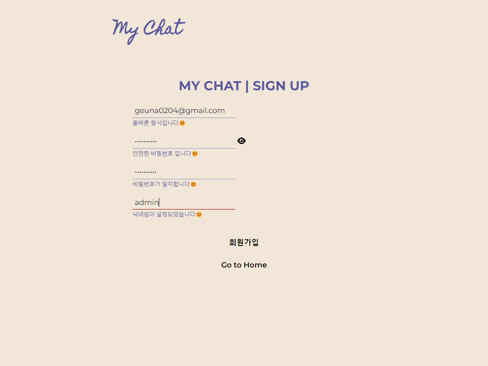

# My Chat  
  
   
      
  
➡️ [Go To My Chat](https://green9930.github.io/my-chat)  
    
  
## 기획 의도

- Firebase v9을 활용한 실시간 채팅 웹 페이지 제작
- TypeScript와 React를 사용한 프로젝트 제작
  

## Tech Stack

- Front-End
  - TypeScript
  - React
  - React Router v6
  - React Helmet
- Back-End
  - Firebase v9
  
    
## Preview
  

  
  
  
  
  
  
  
  
## 주요 기능

- 회원 관리
  - Firebase Auth를 활용한 이메일 기반 회원가입 및 로그인 사용자 관리
- 친구 목록 조회 및 채팅
  - 회원가입한 이용자 목록 조회 및 채팅방 생성 또는 (생성된 경우) 채팅방 참여 기능
  
  